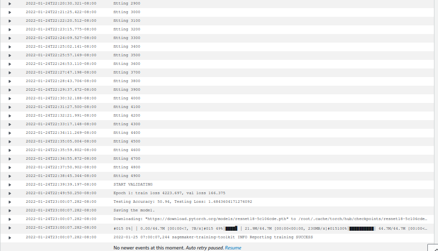
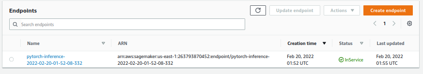

# Image Classification using AWS SageMaker

Use AWS Sagemaker to train a pretrained model that can perform image classification by using the Sagemaker profiling, debugger, hyperparameter tuning and other good ML engineering practices. This can be done on either the provided dog breed classication data set or one of your choice.

## Project Set Up and Installation
Enter AWS through the gateway in the course and open SageMaker Studio. 
Download the starter files.
Download/Make the dataset available. 

## Dataset
The provided dataset is the CIFAR10 classification dataset which can be found in the torchvision datasets library.

### Access
Upload the data to an S3 bucket through the AWS Gateway so that SageMaker has access to the data. 

## Hyperparameter Tuning
<!-- What kind of model did you choose for this experiment and why? Give an overview of the types of parameters and their ranges used for the hyperparameter search

Remember that your README should:
- Include a screenshot of completed training jobs
- Logs metrics during the training process
- Tune at least two hyperparameters
- Retrieve the best best hyperparameters from all your training jobs
 -->
Training jobs screencapture is training_jobs.png. The logs are in batch-size_10_lr_0_09386252244689186.png and batch-size_10_lr_0_09727184909755177.png. 




I chose the resnet18 model since I have experience with it from exercises (and it is pretrained for shorter training time). I used parameter ranges lr 0.001 to 0.002 and batch size 10 and 32.

## Code Files
The code files, in the project, are hpo.py, which is used for training models in the hyperparameter tuner, inference2.py, which is for the entrypoint for the model when deploying to an endpoint, and train_model.py, which is used for training the best hyperparameter model but also collecting debug and profiling data.

## Debugging and Profiling
<!-- **TODO**: Give an overview of how you performed model debugging and profiling in Sagemaker -->
I used the debugger and profiler libraries to plot the loss.

### Results
<!-- **TODO**: What are the results/insights did you get by profiling/debugging your model? -->

I found that loss was decreasing, but I can run training for longer to see chance for better results.

<!-- **TODO** Remember to provide the profiler html/pdf file in your submission. -->
Profiler html is in ./ProfilerReport.


## Model Deployment
<!-- **TODO**: Give an overview of the deployed model and instructions on how to query the endpoint with a sample input. -->

The deployed endpoint is accepting bytes for an image, but the butes should be saved from and image. This is implemented in train_and_deploy.ipynb with the Image and io.BytesIO modules. Here is a code sample:

```
import gzip 
import numpy as np
import random
import os
from PIL import Image
import io

file = 'data/cifar-10-batches-py/data_batch_1'
def unpickle(file):
    import pickle
    with open(file, 'rb') as fo:
        data = pickle.load(fo, encoding='bytes')
    return data

data=unpickle(file)
data=np.reshape(data[b'data'][0], (32, 32, 3), order='F')
im = Image.fromarray(data,mode='RGB')

byteImgIO = io.BytesIO()
im.save(byteImgIO, "PNG")
byteImgIO.seek(0)
byteImg = byteImgIO.read()

response=predictor.predict(byteImg, initial_args={"ContentType": "image/jpeg"})
# Image.open(io.BytesIO(byteImg))
response
```

<!-- **TODO** Remember to provide a screenshot of the deployed active endpoint in Sagemaker. -->




## Standout Suggestions
**TODO (Optional):** This is where you can provide information about any standout suggestions that you have attempted.
